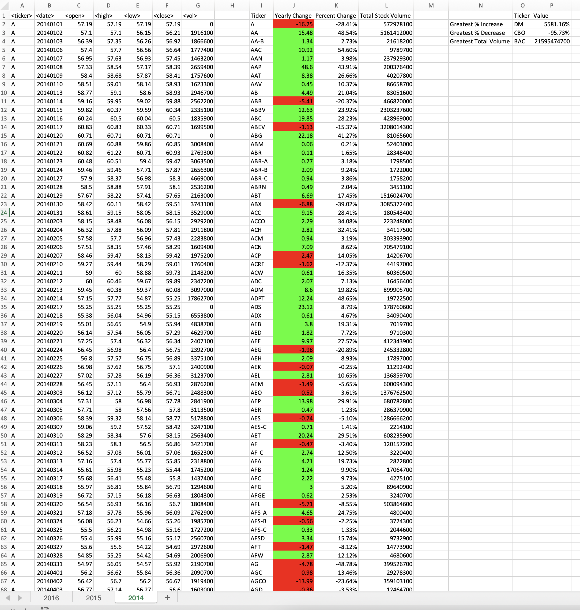

## Summary

The stock marker is constantly updating, piling up thousands of data. In this analysis, we are using VBA to look at how the stock market looked during a certain timeframe.

## Scope
I created a VBA script for analysis on the stock marker from 2014 to 2016. The script was run on a smaller dataset for testing purposes, then applied the script for stock data from 2014-2016. The smaller dataset [alphabetical_testing.xlsx]( https://github.com/carmelamonis/VBA-challenge/blob/main/data/alphabetical_testing.xlsx) is a subset of 2016 data. It is separated into tabs A-F with each tab consisting of tickers starting with their respective letter. Each tab consisted data ranging from 20,000 – 70,000 rows of data.

The VBA script consolidates all the data in each tab and gives as a summary table of each ticker, as well as the overall data in each tab. This included yearly change, percent change, and total stock volume. The script was written to gather all the information for each ticker in each tab so the script only had to run once.The same script was run on the original dataset for stock data from 2014-2016. Snapshots of the yearly results can be seen in the images corresponding that specific year.

#### Note: 
Original dataset of stock data from 2014-2016 could not be uploaded due to size. Each year was separated into their respective tab consisting of 700,000+ rows of data per year.
